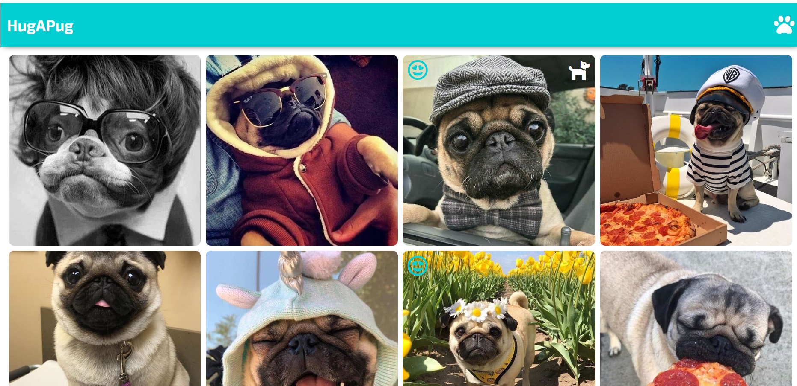
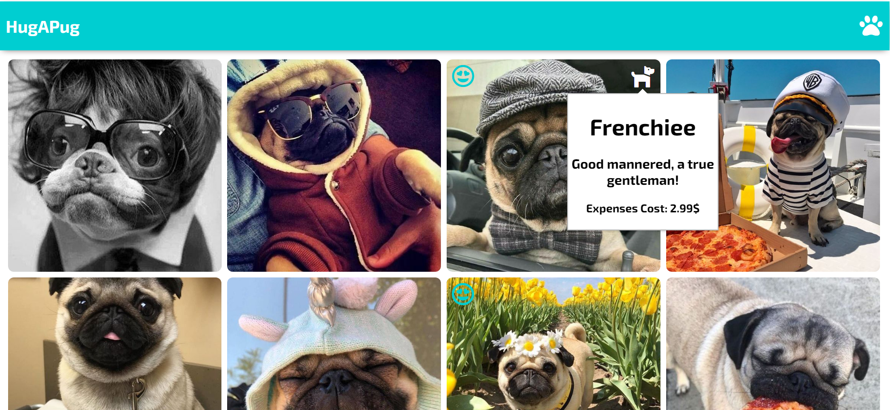
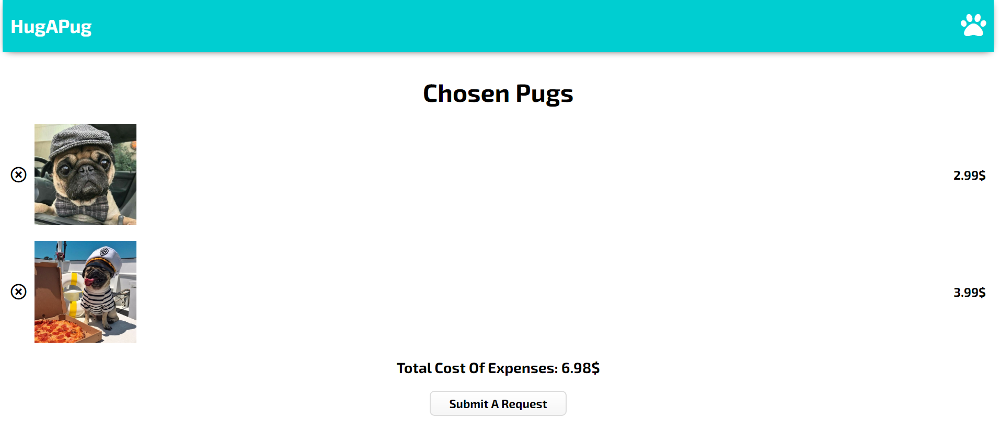

# Hug A Pug
## Description

Stuck at home because of COVID-19? Why not get a cute pug at it?

'Hug A Pug' provides a service for humans that want to rent the services of our cute puggy pups! In times like these, where COVID-19 has prevented us from having any human contact, we can now supplement it with some pug love!
## How Does The Site Work?






## Technology Wise

This mini-project was created purely on client-site, using `React`. 
Each of the components are purely functional components (usage of React hooks).
For routing, `react-router` is used. 
For maintaining information between pages/components `React Context` is used.


## Getting Started

These instructions will get you a copy of the project up and running on your local machine for development and testing purposes.
### Prerequisites
Packages :
* `npm`
* `react`
* `react-router-dom`
* `reactjs-popup`
### Installing
```
npm install npm@latest -g
```
``` 
npm install react --save
```
```
npm install react-dom --save
```
```
npm install react-router --save
```
```
npm install reactjs-popup --save
```
